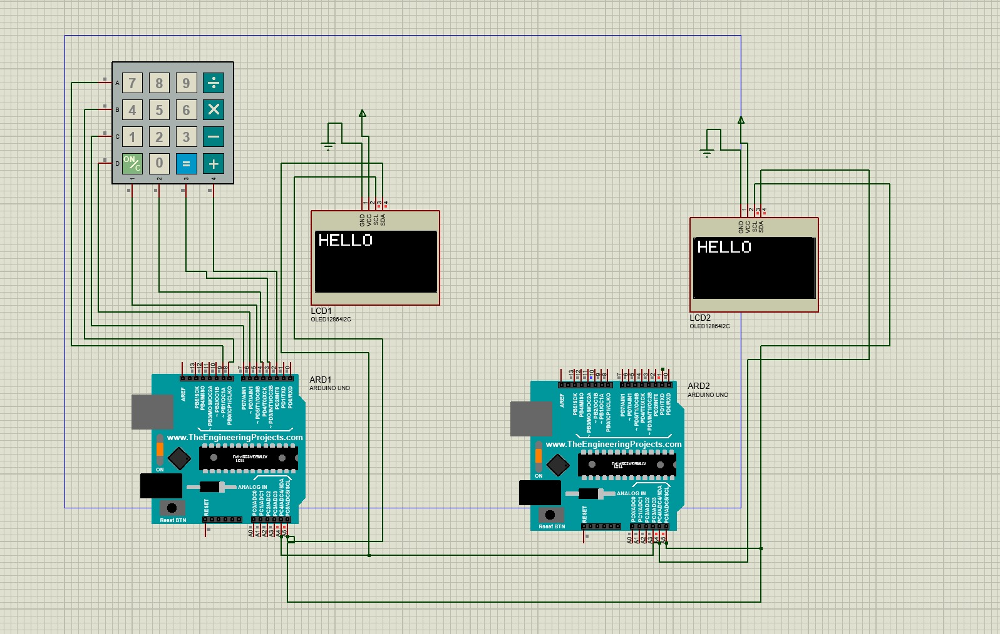
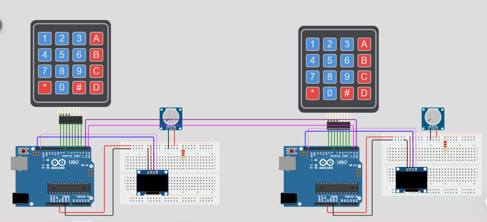
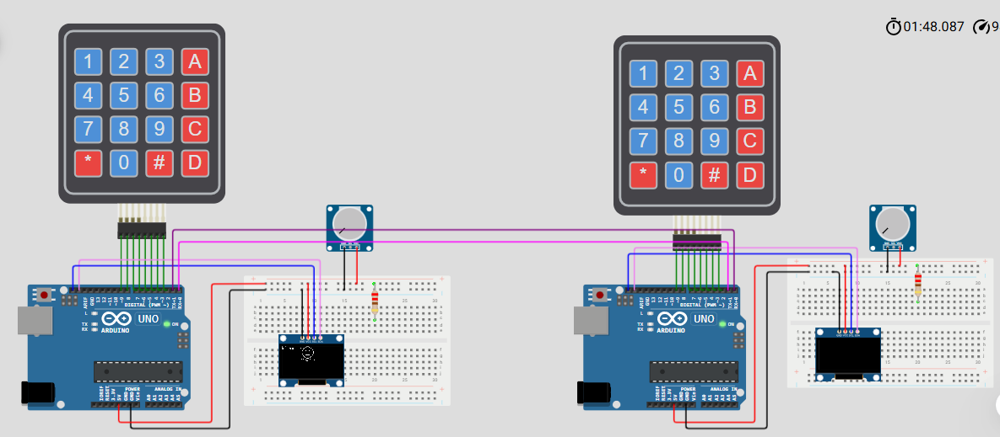
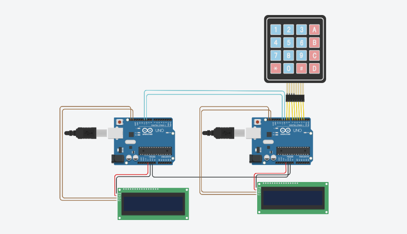
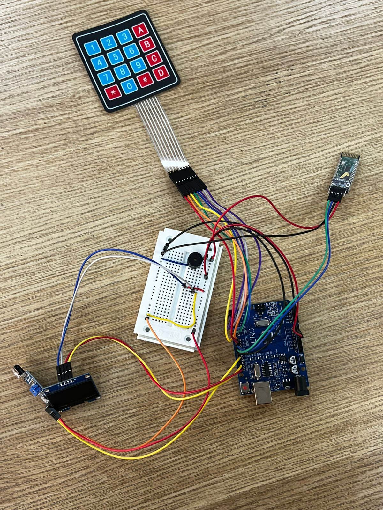
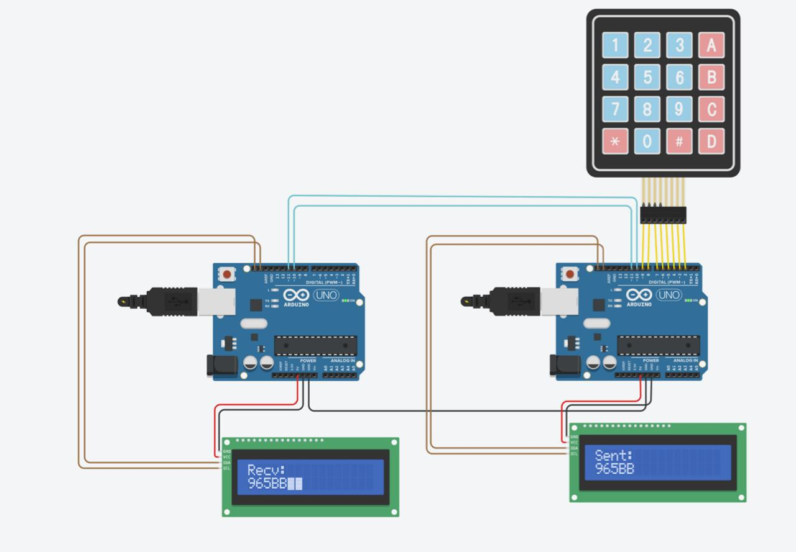
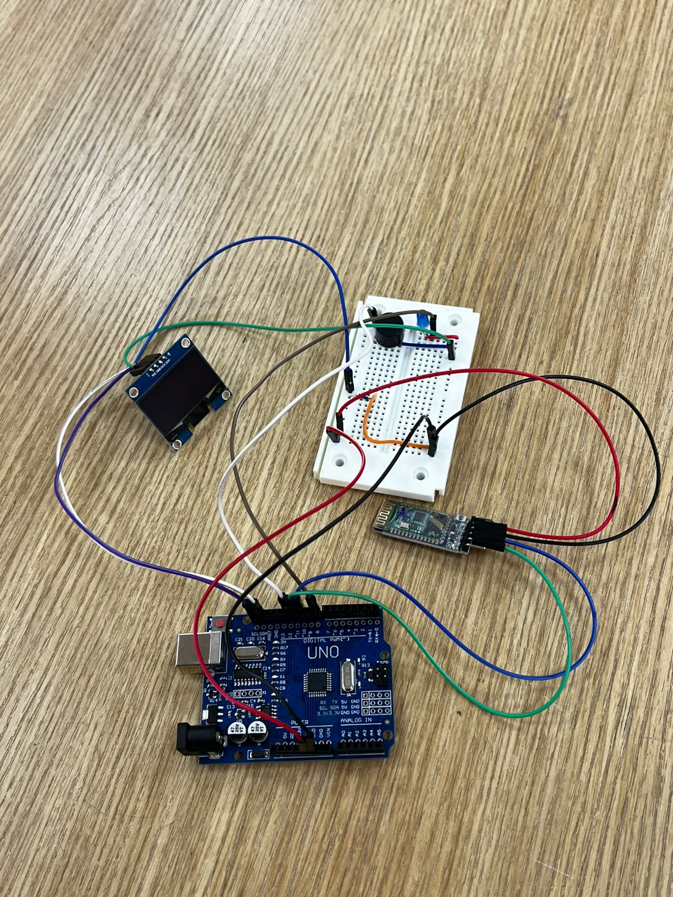

# 2-Way Wireless Chat System (Arduino & Bluetooth)

An embedded wireless two-way chat communication system built with two **Arduino Uno** boards communicating via **HC-05 Bluetooth modules** in Master-Slave architecture. The system features dynamic OLED display output, interactive keypad typing, buzzer audio notifications, and intelligent proximity power-saving using an IR sensor.

---

### Circuit Schematics & Simulation
| Proteus Circuit Diagram | Wokwi Interactive Setup |
| :---: | :---: |
|  |  |

| Wokwi Master & Slave | Prototype Setup |
| :---: | :---: |
|  |  |

---

### Hardware Implementation
| Master Device Setup | Slave Device Setup | Complete System Hardware |
| :---: | :---: | :---: |
|  |  |  |
---

### Hardware Implementation
| Master Device Setup | Slave Device Setup | Complete System Hardware |
| :---: | :---: | :---: |
|  |  |  |

---

##  Source Code Layout
* [`src/master.ino`](./src/master.ino) : Master node code
*  [`src/slave.ino`](./src/slave.ino) : Slave node code
*  [`src/bluetooth_at.ino`](./src/bluetooth_at.ino) : HC-05 AT configuration script
